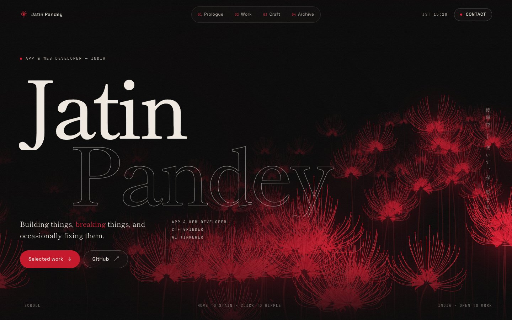
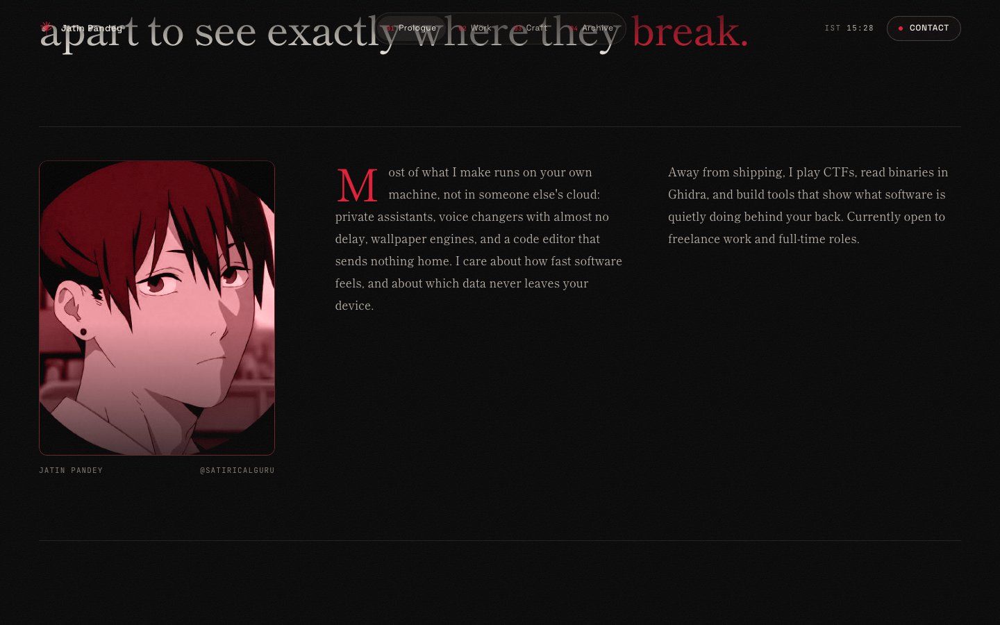
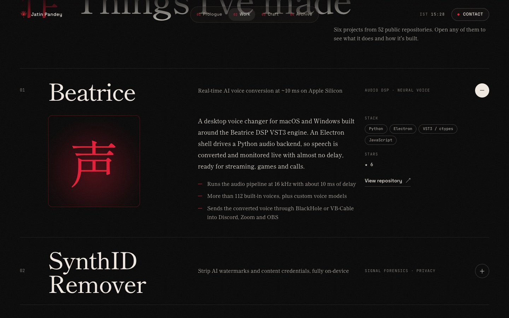

<div align="center">

<a href="https://satiricalguru.github.io/"></a>

<a href="https://satiricalguru.github.io/"></a>

<p>
  <a href="https://satiricalguru.github.io/"></a>
  <a href="https://satiricalguru.vercel.app/"></a>
  <a href="https://github.com/satiricalguru/satiricalguru.github.io/actions"></a>
</p>
<p>
  
  
  
  
  
  
</p>

<a href="https://satiricalguru.github.io/"></a>

<sub>▶ <a href="docs/media/intro.mp4">Watch the full-quality recording (MP4)</a> · or better, <a href="https://satiricalguru.github.io/">open the live site</a>, move your cursor through the field and click.</sub>

</div>

---

## 🩸 The idea

Inspired by the white spider lilies of *Tokyo Ghoul* that slowly stain red, the hero is a **living field of higanbana**, every petal, stamen and stem drawn procedurally on a canvas, at 60 fps.

| | Interaction | What happens |
|:-:|---|---|
| 🌱 | **Load** | A `1000 − 7` countdown ticks to 6, the curtain lifts, flowers grow and open **white** |
| 🩸 | **Wait** | A red wave travels through the field, turning every lily crimson |
| 🖱️ | **Move** | Your cursor **stains** whatever it brushes and the heads lean away from it |
| 💥 | **Click** | A ripple washes the field white, then red **bleeds back** from the same point |
| 📜 | **Scroll** | The whole field drains to red as you leave the hero |

## 📸 Screens

<table>
  <tr>
    <td colspan="2"><br><sub><b>序 Hero</b> — the field in full bloom</sub></td>
  </tr>
  <tr>
    <td width="50%"><br><sub><b>序 Prologue</b> — scroll-lit statement, bio and live GitHub stats</sub></td>
    <td width="50%"><br><sub><b>作 Work</b> — rows fill with blood on hover and open into a case study</sub></td>
  </tr>
  <tr>
    <td width="50%"><br><sub><b>技 Craft</b> — four disciplines and an outlined tech marquee</sub></td>
    <td width="50%"><br><sub><b>録 Archive</b> — every public repo, filterable, refreshed each build</sub></td>
  </tr>
  <tr>
    <td width="50%"><br><sub><b>連 Contact</b> — an already-red field grows beneath the footer</sub></td>
    <td width="50%" align="center"><br><sub><b>📱 Mobile</b> — fully responsive, no horizontal scroll</sub></td>
  </tr>
</table>

## ✨ Details

- **Procedural flowers:** each lily is an umbel of 6 to 8 florets with six recurved tepals and seven upswept stamens. It's built from Bézier curves and drawn with about three draw calls per flower (`src/lib/higanbana.ts`).
- **Colour waves:** waves fronts move outward from a point, and each flower records the moment a front reaches it. That is how the white wash, the red bleed and the cursor stains coexist.
- **Quiet chrome:** taking a cue from [Active Theory](https://activetheory.net), the page is void black with hairline borders, frosted pill controls and tiny mono labels, so the artwork carries all the colour.
- **Motion:** masked letter reveals, a statement that lights word by word as you scroll, a cursor-following kanji seal, a custom cursor, film grain and Lenis smooth scrolling.
- **Accessibility:** fully keyboard-usable. `prefers-reduced-motion` renders a single still frame, and the field pauses whenever it's offscreen or the tab is hidden.
- **Type:** Shippori Mincho for display and body, Space Grotesk for UI, JetBrains Mono for labels.

## 🧱 Structure

```text
src/
├── lib/higanbana.ts     # procedural spider-lily engine
├── lib/motion.ts        # smooth scroll, reveal + scroll-progress hooks
├── components/          # Preloader · Nav · Hero · Prologue · Works · Craft · Archive · Contact
├── data/projects.ts     # featured work, disciplines, socials
└── data/github*.json    # generated from the GitHub API at build time
scripts/fetch-github-data.js
docs/media/              # README screenshots + recording
```

## 🚀 Run it

```bash
git clone https://github.com/satiricalguru/satiricalguru.github.io.git
cd satiricalguru.github.io
npm install
npm run dev        # http://localhost:5173
npm run build      # refreshes GitHub data → type-checks → bundles to dist/
```

`scripts/fetch-github-data.js` pulls repos and follower count before every build. If the network is down, it keeps the cached JSON.

## 🌐 Deploy

- **GitHub Pages:** every push to `main` runs `.github/workflows/deploy.yml`.
- **Vercel:** a mirror at [satiricalguru.vercel.app](https://satiricalguru.vercel.app).

<div align="center">

<br>

<sub>Designed & built by <a href="https://github.com/satiricalguru"><b>Jatin Pandey</b></a> · <a href="https://x.com/JayDevSG">@JayDevSG</a> · <code>1000 − 7 = 993</code></sub>


</div>
